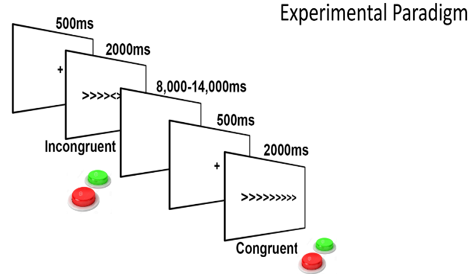
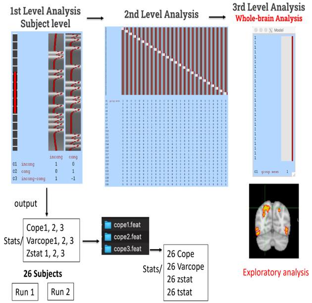

# Investigating Cognitive Control using fMRI: A Comprehensive Data Analysis Report

## Abstract

This report presents a detailed analysis of the Flanker Dataset using functional magnetic resonance imaging (fMRI) to explore the neural basis of cognitive control. The study focuses on investigating differences in the BOLD signal between Congruent and Incongruent Flanker trials. Various analyses, including quality control, preprocessing, statistical modeling, and post-analysis, were conducted using the FSL software. The findings contribute valuable insights into the neural mechanisms underlying cognitive control and response inhibition.

## Table of Contents

- [Introduction](#introduction)
- [Experimental Design](#experimental-design)
- [Data Collection](#data-collection)
- [Analysis](#analysis)
  - [Quality Control](#quality-control)
  - [Preprocessing](#preprocessing)
  - [First-Level Analysis](#first-level-analysis)
  - [Second-Level Analysis](#second-level-analysis)
  - [Third-Level Analysis](#third-level-analysis)
  - [ROI Analysis](#roi-analysis)
- [Results and Interpretation](#results-and-interpretation)
- [Discussion](#discussion)
- [Conclusion](#conclusion)
- [References](#references

## Introduction

Cognitive control processes, particularly attention and response inhibition, were investigated using the Flanker Dataset and fMRI. This report details the experimental design, data collection procedures, and a comprehensive analysis pipeline.

## Experimental Design
 
Figure 1, Flanker Task Trial

The Flanker task, a well-established paradigm for studying cognitive control, was employed. Participants were presented with Congruent and Incongruent Flanker trials, requiring a button press based on the central arrow's direction.

## Data Collection

Twenty-six adult participants underwent 2 fMRI runs while performing the Flanker task. High-resolution anatomical images and functional scans were acquired.

## Analysis
 
Figure 1, Project Workflow

### Quality Control

Quality control procedures identified motion artifacts in specific subjects, addressing potential confounds in the subsequent analysis.

### Preprocessing

Anatomical and functional images underwent preprocessing steps, including brain extraction, temporal filtering, motion correction, smoothing, registration of functional to anatomical, and normalization to the MNI152 template.

### First-Level Analysis

The first-level analysis included GLM modeling with contrasts for congruent and incongruent conditions. Post-stats analysis identified activated pixels and clusters.

### Second-Level Analysis

Different algorithms, including Fixed Effect, Flame 1, and Simple OLS, were applied in the second-level analysis to determine the most effective approach "Fixed Effect".

### Third-Level Analysis

Whole-brain analysis was performed using Flame 1 based on the Fixed Effect algorithm.

### ROI Analysis

Regions of interest (ROIs) were identified and confirmed using a confirmation test to ensure the significance of the identified clusters.

## Results and Interpretation

### Postcentral Gyrus
Activation in the postcentral gyrus suggests that sensory processing is actively engaged during both congruent and incongruent stimuli. This area plays a key role in processing the sensory information needed for responding to the presented stimuli, contributing to the participants' ability to perform the task accurately.

### Insular Cortex
The insular cortex exhibited activation, potentially reflecting the emotional and interoceptive processing that occurs during the task. This region's involvement may indicate that subjects experience subtle emotional responses or bodily sensations even in the context of both congruent and incongruent stimuli.

### Cingulate Gyrus
The activation of the cingulate gyrus highlights its role in attentional control and performance monitoring. This region's engagement suggests that participants are actively maintaining attention and monitoring their performance to ensure accuracy in responding to both congruent and incongruent stimuli.

### Temporal, Occipital, and Occipitotemporal Lobes
These regions are primarily involved in visual processing. Their activation during the task underscores the participants' active engagement in perceiving and processing the visual stimuli, which is crucial for recognizing and responding to the presented arrows accurately.

### Frontal Pole
The frontal pole's activation suggests the involvement of higher-order cognitive processes during the task. This region may be responsible for decision-making and integrating information over time, contributing to efficient task performance when dealing with both congruent and incongruent stimuli.

### Paracingulate Gyrus
Activation in the paracingulate gyrus indicates that cognitive control and decision-making processes are at play. This region likely supports the participants in regulating their responses and making quick, accurate decisions based on the congruent and incongruent stimuli presented during the task.

## Discussion

In the confirmatory analysis, we explored two approaches to better understand the brain's activation patterns: the use of atlas-based masks and more localized spherical masks.

From the initial analysis using atlas-based masks, COPE 1 and COPE 2 both exhibited p-values below the significance threshold, indicating statistically significant activation. Specifically, COPE 1 had a p-value of 0.00066, and COPE 2 had a p-value of 0.016, both allowing us to reject the null hypothesis. However, COPE 3 showed a higher p-value, suggesting no significant activation. This result is likely due to the inclusion of large portions of the brain that are inactive or unrelated to the task, leading to an averaging effect that masks true activations.

To address this issue, we shifted to a more precise analysis using spherical masks centered around specific peak activation voxels. We identified the peak voxel at MNI coordinates (0, 20, 44) and generated a 7mm radius sphere mask to localize the region of interest. Using this targeted approach, we observed that the p-values for all COPEs were below the significance threshold, allowing us to reject the null hypothesis in each case. This refined method captures more relevant activations by focusing on specific, task-related brain regions, leading to more accurate results.

Moreover, when using the weighted approach for creating the sphere, the averaged Z-statistics for the 26 subjects increased, reflecting a better capture of true activations. By weighting each voxel by its probability of activation, we enhanced the detection of task-relevant signals, allowing higher-probability voxels to contribute more significantly to the overall estimate. This contrasts with binarized masks, where less relevant voxels may dilute the effect.

The presence of widespread negative Z-values during the analysis indicates deactivation in regions not directly involved in task processing. This deactivation aligns with the notion that task-irrelevant areas, such as those in the default mode network, reduce their activity to allow the brain to allocate resources more efficiently to task-related processes.

In conclusion, using localized sphere masks and weighted approaches provided a more accurate representation of brain activity, reducing the influence of unrelated regions and improving the detection of true task-specific activations. This highlights the importance of precise targeting and analysis methods in functional neuroimaging studies.

## Conclusion

Despite indirect relationships observed, the study provides valuable insights into the neural mechanisms underlying cognitive control and response inhibition during the Flanker task.

## References

Kelly, A.M., Uddin, L.Q., Biswal, B.B., Castellanos, F.X., Milham, M.P. (2008). Competition between functional brain networks mediates behavioral variability. Neuroimage, 39(1):527-37
- Soares JM, Magalhães R, Moreira PS, Sousa A, Ganz E, Sampaio A, Alves V, Marques P and Sousa N (2016) A Hitchhiker’s Guide to Functional Magnetic Resonance Imaging. Front. Neurosci. 10:515. doi: 10.3389/fnins.2016.00515
- AndysBrainBook website (https://andysbrainbook.readthedocs.io/en/latest/)

## Contributors 

<table>
  <tr>
     <td align="center">
    <a href="https://github.com/ahmedalii3" target="_black">
    
     
    <b>Ahmed Ali</b></a>
    </td>
<td align="center">
    <a href="https://github.com/ossama971" target="_black">
    
     
    <b>Osama Badawi</b></a>
    </td>
      </tr>
 </table>

